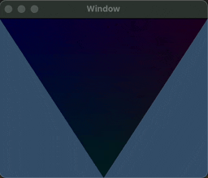
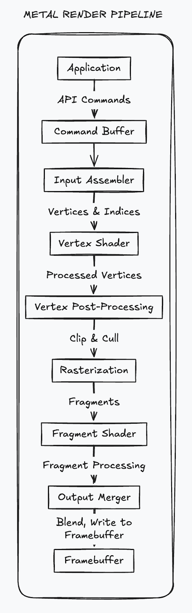
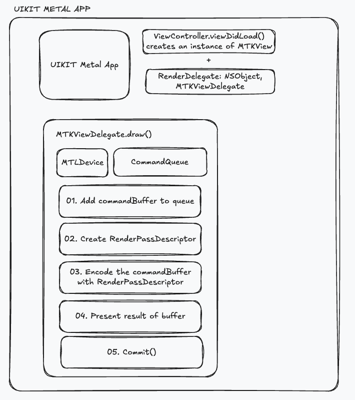

The __XCode project__ can be download [here](../../assets/RainbowTriangle.zip) and contains detailed comments for all steps.


### What is metal?

Metal, Apple’s GPU programming API, offers improved performance over OpenGL, with support for 3D graphics, general GPU computation, and cross-platform compatibility on iOS and macOS. Unlike OpenGL, which abstracts CPU-GPU communication, Metal requires explicit handling, enhancing efficiency and providing insights into low-level graphics programming. This tutorial introduces basic Metal rendering to build foundational skills, like rendering a 2D multi-colored triangle, a “hello world” for graphics. This approach is ideal for learning GPU programming but may be slower than using high-level game engines for game development.

### Metal in a nutshell

* `MTLDevice`: Represents the GPU.
* `MTLCommandQueue`: Manages a queue of MTLCommandBuffers awaiting execution.
* `MTLCommandBuffer`: Holds all the data the GPU needs to run a pipeline, including pipeline settings, vertex data, and drawing commands.
* `MTLRenderPipelineDescriptor` / `MTLRenderPipelineState`: Specifies the render pipeline, defining which vertex and fragment shaders to use. The* enderPipelineState is a compiled version of MTLRenderPipelineDescriptor. A MTLRenderPassDescriptor configures pipeline interfaces like render* et resolution and is included with each MTLCommandBuffer.
* `MTLRenderCommandEncoder`: Prepares vertex data and drawing commands for the pipeline.
* `MTLBuffer`: Represents a data block accessible by both the CPU and GPU. We use MTLBuffer to create vertex data on the CPU, which the GPU can then access in shader code.

### Metal render-pipeline in a nutshell

In a 3D graphics pipeline, vertex geometry is first generated on the CPU and then sent to the GPU, where it goes through a sequence of steps (or pipeline) that transform vertex data into a final rendered image. This process includes customizing what happens within the pipeline, essential to Metal programming. In this tutorial, the goal is to understand and implement a simple pipeline in Metal that renders a basic 2D triangle by breaking down these steps into manageable code components.

The stages of the Metal pipeline are summarized in the following list. Note that only the first stage, encoding drawing commands, is performed on the CPU, with all subsequent steps executed on the GPU.

1. Encoding Drawing Commands / Vertex Data: Prepares data for the GPU to process in the pipeline.
2. Vertex Shader: Transforms 3D vertex positions into 2D screen coordinates and passes data down the pipeline.
3. Tessellation: Subdivides triangles into smaller ones for higher-quality rendering.
4. Rasterization: Converts 2D geometric data into discrete pixels and interpolates vertex data across each pixel.
5. Fragment Shader: Uses interpolated pixel data from the rasterizer to determine each pixel’s final color.



---

## Project Setup

This article is loosely based on [Donald Pinckney Post](https://donaldpinckney.com/metal/2018/07/05/metal-intro-1.html).
In this project we start from a UIKit Storyboard, then add an MKTView to display the Metal content.



To create a basic one-window macOS app for Metal in Xcode:

1. Open Xcode and select “Create a new Xcode project.”
2. Choose “Cocoa App” under “macOS.”
3. Set the language to Swift, and check “Use Storyboards” (leave “Create Document-Based Application” unchecked).
4. Name the project and select a save location.
5. Run the app (⌘R) to verify a blank window appears, which will later display your 3D graphics.

This sets up a macOS app with a window for rendering Metal content.

---
## Setting Up Metal View

To set up an MTKView for Metal rendering start by modifying the Storyboard and changing the root view’s class to MTKView.

#### Step 1: Import the Required Frameworks

You need to import the Metal and MetalKit frameworks at the beginning of your Swift file:
    
```swift
import Metal
import MetalKit
```

#### Step 2: Create the View Controller Class

Create a class that inherits from NSViewController:

```swift
    class ViewController: NSViewController {
        var mtkView: MTKView!
        var renderer: Renderer!
    }
```

#### Step 3: Implement the viewDidLoad Method

In this method, you will initialize your MTKView and set up the Metal device:

1.	Save the MTKView: Use type casting to ensure the view is an MTKView. If it isn’t, print an error message.

```swift
        guard let mtkViewTemp = self.view as? MTKView else {
            print("View attached to ViewController is not an MTKView!")
            return
        }
        mtkView = mtkViewTemp
```

2. Create the Default Metal Device: Retrieve the default GPU device using MTLCreateSystemDefaultDevice(). If it’s not supported, print an error message.

```swift
        guard let defaultDevice = MTLCreateSystemDefaultDevice() else {
            print("Metal is not supported on this device")
            return
        }
        print("My GPU is: \(defaultDevice)")
        mtkView.device = defaultDevice
```

3. Initialize the Renderer: Create an instance of a custom Renderer class that handles drawing. If initialization fails, print an error.

```swift
        guard let tempRenderer = Renderer(mtkView: mtkView) else {
            print("Renderer failed to initialize")
            return
        }
        renderer = tempRenderer
```

4.	Set the Delegate: Finally, assign the renderer as the delegate of the mtkView so that it can handle rendering tasks.

```swift
        mtkView.delegate = renderer
```

This code sets up a basic Metal rendering environment within a macOS application. By initializing the MTKView and creating a Renderer, you prepare your app to display graphics. The next steps would involve implementing the rendering logic in the Renderer class.

--- 
## Creating a Renderer with Metal

Now we will go through the Renderer class that handles drawing in a Metal application. This class is essential for rendering graphics on the screen using Metal’s GPU capabilities.

#### Step 1: Import Necessary Frameworks

At the top of your Swift file, ensure you import the required frameworks:

```swift
    import Foundation
    import Metal
    import MetalKit
```

#### Step 2: Define the Renderer Class

Create a class named Renderer that conforms to the MTKViewDelegate protocol. This allows the class to respond to rendering requests from the MTKView.

```swift
    class Renderer: NSObject, MTKViewDelegate {
        let device: MTLDevice
        let commandQueue: MTLCommandQueue

        init?(mtkView: MTKView) {
            device = mtkView.device!
            commandQueue = device.makeCommandQueue()!
        }
```

* __MTLDevice__: Represents the GPU hardware.
* __MTLCommandQueue__: A queue that manages the command buffers sent to the GPU.

#### Step 3: Implement the draw(in:) Method

This method is called whenever the MTKView needs to render new content.

```swift
    func draw(in view: MTKView) {
        guard let commandBuffer = commandQueue.makeCommandBuffer() else { return }
        guard let renderPassDescriptor = view.currentRenderPassDescriptor else { return }

        // Change clear color to red
        renderPassDescriptor.colorAttachments[0].clearColor = MTLClearColorMake(1, 0, 0, 1)

        guard let renderEncoder = commandBuffer.makeRenderCommandEncoder(descriptor: renderPassDescriptor) else { return }

        // TODO: Here is where we need to encode drawing commands!

        renderEncoder.endEncoding()
        commandBuffer.present(view.currentDrawable!)
        commandBuffer.commit()
    }
```

* __Command Buffer__: Represents a set of commands to be executed by the GPU.
* __Render Pass Descriptor__: Defines the framebuffer for rendering.
* __Render Command Encoder__: Used to encode drawing commands to be sent to the GPU.

#### Step 4: Handle Size Changes

Implement the mtkView(_:drawableSizeWillChange:) method to handle changes in the view’s size (like window resizing). This method can be left empty for now:

```swift
    func mtkView(_ view: MTKView, drawableSizeWillChange size: CGSize) {
        // Handle size changes if needed
    }
```

This Renderer class sets up the necessary components for rendering with Metal. In the draw(in:) method, you can add specific drawing commands to create graphics on the screen. In the next steps, you can enhance the rendering logic by adding shapes or 3D models.

---

## Creating Vertex and Fragment Shaders in Metal

In this section, we’ll create vertex and fragment shaders using the Metal Shading Language (MSL) and share data structures between Swift and Metal.

#### Step 1: Set Up a Bridging Header

1. Create an Objective-C File: In Xcode, create a new Objective-C file. Name it anything you like.
1. Create Bridging Header: When prompted, click “Create Bridging Header.” You can delete the Objective-C file afterward.
1. Create a C Header File: Add a new “Header File” and name it ShaderDefinitions.h.
1. Modify Bridging Header: Add the following line to your bridging header:

```c        
        #include "ShaderDefinitions.h"
```

#### Step 2: Define Vertex Structure

1.	Include SIMD Library: In ShaderDefinitions.h, add:

```c        
        #include <simd/simd.h>
```

2.	Define the Vertex Structure: Add the following struct definition to ShaderDefinitions.h:

```c
        struct Vertex {
            vector_float4 color; // RGBA
            vector_float2 pos;   // 2D position
        };
```

#### Step 3: Create Metal Shaders

1.	Create a Metal File: In Xcode, create a new “Metal file” named Shaders.metal.
2.	Add Shader Functions: Inside Shaders.metal, define the vertex and fragment shaders:

```c
        vertex void vertexShader()
        {
            // Vertex shader implementation
        }

        fragment void fragmentShader()
        {
            // Fragment shader implementation
        }
```

#### Next Steps

You’ll need to define the parameters and return types of your shaders to make them functional. After that, you’ll load the shaders and set up the vertex data on the CPU. This foundation allows your Metal application to share data structures between CPU and GPU seamlessly.

---
## Setting Up a Custom Render Pipeline in Metal

To utilize your shaders, you need to create a custom rendering pipeline in your Renderer.swift file. This involves configuring a MTLRenderPipelineDescriptor and compiling it to a MTLRenderPipelineState during initialization.

#### Step 1: Define the Pipeline Function

Add the following function stub to the Renderer class:

```c
    class func buildRenderPipelineWith(device: MTLDevice, metalKitView: MTKView) throws -> MTLRenderPipelineState {
        // ...
    }
```

#### Step 2: Create the Pipeline Descriptor

Inside the buildRenderPipelineWith function, construct a MTLRenderPipelineDescriptor:

```swift
    let pipelineDescriptor = MTLRenderPipelineDescriptor()
```

#### Step 3: Configure the Shaders

Load the vertex and fragment shaders from Shaders.metal using the default library:

```swift
    let library = device.makeDefaultLibrary()
    pipelineDescriptor.vertexFunction = library?.makeFunction(name: "vertexShader")
    pipelineDescriptor.fragmentFunction = library?.makeFunction(name: "fragmentShader")
```

#### Step 4: Set the Output Pixel Format

Ensure the pixel format matches the MTKView:

```swift
    pipelineDescriptor.colorAttachments[0].pixelFormat = metalKitView.colorPixelFormat
```

#### Step 5: Compile the Pipeline

Compile the pipeline descriptor into a state object and handle potential errors:

```swift
    return try device.makeRenderPipelineState(descriptor: pipelineDescriptor)
```

#### Step 6: Save the Pipeline State

Add an instance variable to store the pipeline state in the Renderer class:

```swift
    let pipelineState: MTLRenderPipelineState
```

#### Step 7: Initialize the Pipeline State

In the Renderer initializer, create the render pipeline:

```swift
    do {
        pipelineState = try Renderer.buildRenderPipelineWith(device: device, metalKitView: mtkView)
    } catch {
        print("Unable to compile render pipeline state: \(error)")
        return nil
    }
```

This setup allows your Metal application to efficiently render graphics by configuring a pipeline that uses the defined shaders and matches the output format of your MetalKit view.

---
## Sending Vertex Data and Drawing Commands to the GPU

To render a triangle in Metal, you need to prepare vertex data and send it to the GPU. Here’s how to implement this in your Renderer.swift.

#### Step 1: Define Vertex Data

In the Renderer initializer, create an array of vertices with their corresponding colors:

```swift
    let vertices = [
        Vertex(color: [1, 0, 0, 1], pos: [-1, -1]),  // Red vertex
        Vertex(color: [0, 1, 0, 1], pos: [0, 1]),   // Green vertex
        Vertex(color: [0, 0, 1, 1], pos: [1, -1])    // Blue vertex
    ]
```

#### Step 2: Create a Vertex Buffer

Add an instance variable for the vertex buffer:

```swift
    let vertexBuffer: MTLBuffer
```

Then, allocate the buffer in the initializer:

```swift
    vertexBuffer = device.makeBuffer(bytes: vertices, length: vertices.count * MemoryLayout<Vertex>.stride, options: [])!
```

This buffer allows the GPU to access the vertex data.

#### Step 3: Encode Drawing Commands

In the draw(in view: MTKView) function, after creating the renderEncoder, set the pipeline and vertex buffer:

```swift
    // Setup render commands to encode
    renderEncoder.setRenderPipelineState(pipelineState)
    renderEncoder.setVertexBuffer(vertexBuffer, offset: 0, index: 0)
```

Then, encode the drawing command:

```swift
    renderEncoder.drawPrimitives(type: .triangle, vertexStart: 0, vertexCount: 3)
```

This tells Metal to draw a triangle using the specified vertices.

With this setup, you’ve configured vertex data, created a buffer for GPU access, and encoded drawing commands, enabling the rendering of a colored triangle using Metal.

---
## Type Signatures of Vertex and Fragment Shaders

The vertex and fragment shaders are crucial components for rendering in Metal. Here’s how to correctly define their type signatures:

#### Vertex Shader

The vertex shader processes vertex data and requires the following parameters:

```c
    vertex VertexOut vertexShader(const device Vertex *vertexArray [[buffer(0)]], unsigned int vid [[vertex_id]]) {
        // TODO: Write vertex shader
    }
```

Parameters:
* vertexArray: Pointer to the vertex data.
* vid: Vertex ID, which indexes into the vertex buffer.

#### Fragment Shader

The fragment shader outputs the final pixel color and is defined as follows:

```c
    fragment float4 fragmentShader(VertexOut interpolated [[stage_in]]) {
        // TODO: Write fragment shader
    }
```

Parameters:
* interpolated: Receives interpolated data from the vertex shader.

#### Output Structure

Define an output structure for the vertex shader:

```c
    struct VertexOut {
        float4 color;
        float4 pos [[position]];
    };
```

Fields:
* `color`: Color of the vertex.
* `pos`: Normalized screen-space position, marked with [[position]] for rasterization.

This setup ensures the correct data flow between the shaders for rendering your triangle.

---
## Writing Vertex and Fragment Shader Code

Here’s how to implement the vertex and fragment shaders:

Vertex Shader Implementation:

1.	Fetch the vertex data using the vertex ID:

```c
        Vertex in = vertexArray[vid];
```

2.	Create an instance of VertexOut and set its properties:

```c
        VertexOut out;

        // Pass the vertex color directly to the rasterizer
        out.color = in.color;

        // Pass the already normalized screen-space coordinates to the rasterizer
        out.pos = float4(in.pos.x, in.pos.y, 0, 1);

        return out;
```

This shader is often referred to as a pass-through vertex shader because it mainly transfers data without significant modification.

#### Fragment Shader Implementation

The fragment shader is straightforward as it simply returns the interpolated color:

```c
    return interpolated.color;
```

After implementing these shaders, compile and run your code to see the rendered output.
