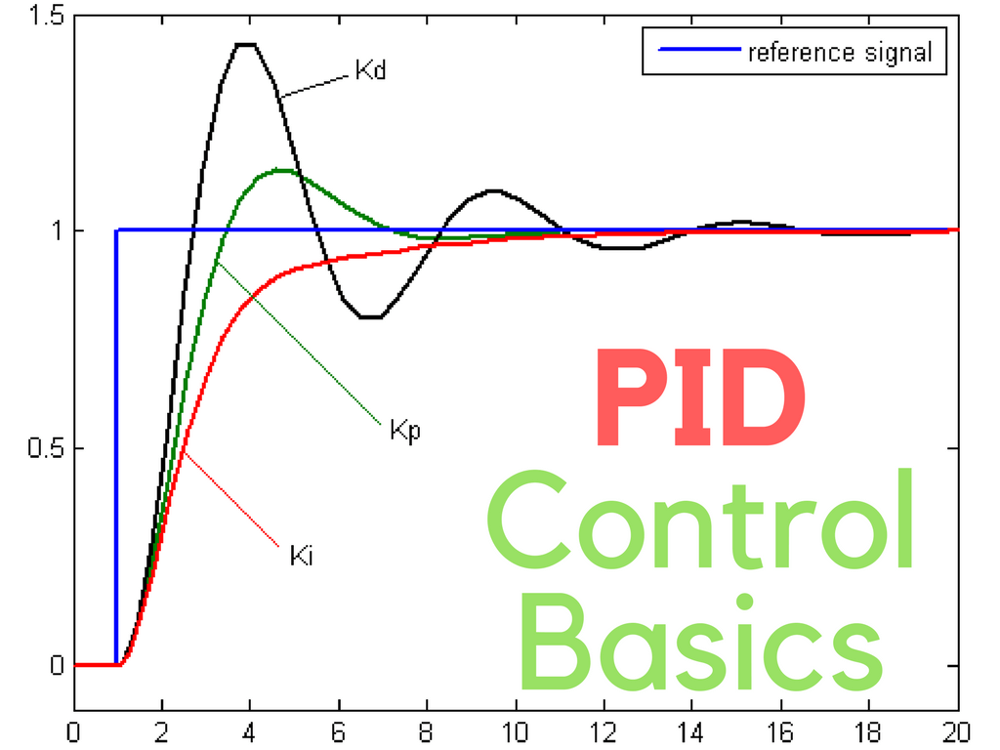
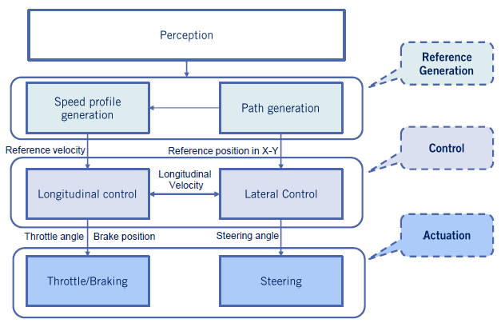
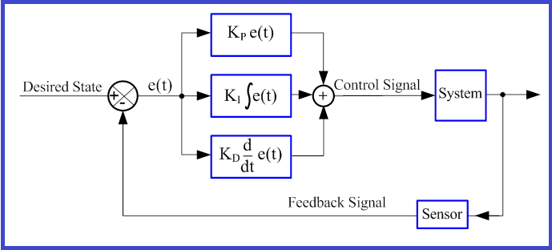
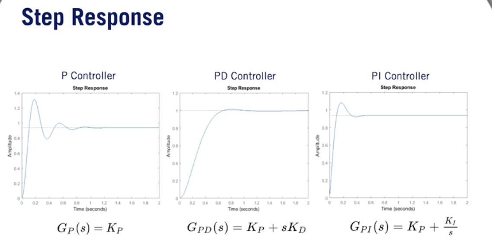
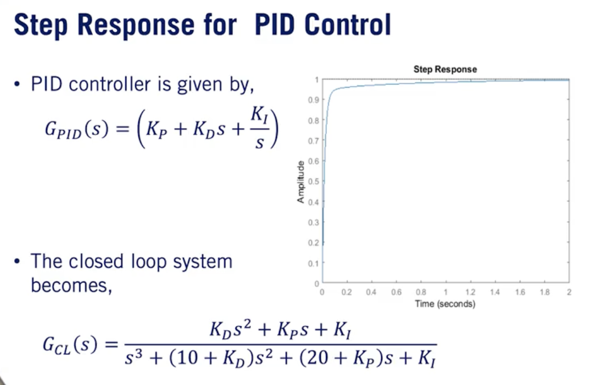
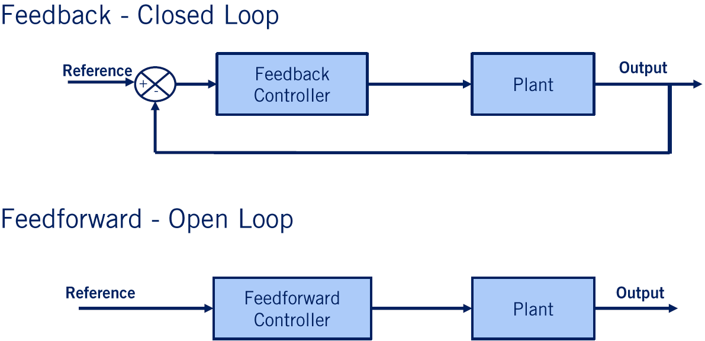
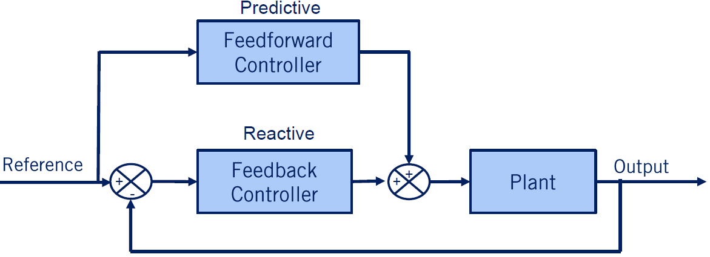

## [__Module 5__: Vehicle Longitudinal Control]((https://www.coursera.org/specializations/self-driving-cars))

#### Lesson 1: Proportional-Integral-Derivative (PID) Control

##### **1. Basics of Longitudinal Control**
Longitudinal control ensures the car maintains the desired speed by adjusting throttle and brake commands. It uses a **feedback loop**:
- Sensors measure the car's current speed.
- The controller compares this to the desired speed.
- Based on the difference (error), it adjusts throttle/brake signals to minimize this error.

---

##### **2. PID Controller**

  

  

The PID (Proportional-Integral-Derivative) controller is a fundamental tool for error correction in longitudinal control:
- **Proportional (P):** Reacts directly to the current error, speeding up response but may overshoot.
- **Integral (I):** Summarizes past errors to eliminate steady-state errors but can increase oscillations.
- **Derivative (D):** Predicts future errors to stabilize the system and reduce overshoot.

  

The PID controller combines these three terms to balance quick response, stability, and accuracy. Gains ($K_p$, $K_i$, $K_d$) must be tuned carefully for optimal performance.

---

##### **3. Transfer Functions**
- A transfer function represents how inputs (like throttle) affect outputs (like speed).
- Using Laplace transforms simplifies analyzing system behavior in terms of poles (stability) and zeros (response).
- The Laplace transform converts functions from the time domain into the frequency (or -domain). It is essential for defining transfer functions because it simplifies differential equations into algebraic equations.

> ⚠️ POLES & ZERO NOTE:
> 
> •	Definition: Poles are the values of  that make the denominator of a transfer function zero. At these values, the system becomes undefined because division by zero occurs.
> 
> •	Significance in Control Systems:
>	•	Poles determine the system’s stability and dynamic behavior.
>	•	For self-driving systems, poles must lie in the left half-plane (negative real part) to ensure stability. Poles also influence the response speed, with larger negative poles leading to faster decay.
>
> Zeros
	•	Zeros are the values of  that make the numerator of a transfer function zero.
>	
> •	Significance in Control Systems:
	•	Zeros shape the system’s transient response and can cancel dynamics introduced by poles.
	•	Proper placement of zeros allows tuning of system behavior, such as improving disturbance rejection or tracking performance.
>
> Your Question: Designing a System with PID and Zero Placement
> 
> Yes, you are correct:
	1.	Isolating Zeros for Frequency Tuning: By strategically placing zeros, you can tune the frequency response of the system to optimize its performance. This is especially useful for systems requiring precise tracking or disturbance rejection.
	2.	Poles and Division by Zero: Poles represent values where the denominator becomes zero, causing division by zero and making the transfer function undefined. These are critical points that define the stability and behavior of the system.
Why This Matters for Self-Driving Cars
In self-driving cars:
	•	Poles and zeros are used to design controllers (like PID) for longitudinal and lateral control systems.
	•	Proper tuning ensures smooth acceleration, braking, and steering while maintaining stability and safety.
For example:
	•	Placing poles further left (negative real parts) improves stability.
	•	Adjusting zeros can enhance transient response, allowing better handling during dynamic maneuvers like lane changes or adaptive cruise control.

---

##### **4. Closed-Loop System**
In a closed-loop system:
- The controller continuously adjusts inputs based on feedback from sensors.
- Performance metrics include:
  - **Rise Time:** How quickly the car reaches the target speed.
  - **Overshoot:** How much it exceeds the target.
  - **Settling Time:** Time to stabilize near the target speed.
  - **Steady-State Error:** Difference between actual and desired speeds once stable.

---

##### **5. PID Tuning**
Tuning methods like Ziegler-Nichols help find optimal gains for specific system responses. Adjusting $K_p$, $K_i$, $K_d$ affects:
- Speed of reaction ($K_p$).
- Elimination of steady-state error ($K_i$).
- Stability and smoothness ($K_d$).

---

##### **6. Application Example**
The spring-mass-damper model demonstrates PID control:
- Without control: The system oscillates and takes time to stabilize.
- With PID control: Proper tuning eliminates overshoot, reduces oscillations, and achieves faster stabilization.

By understanding these principles, you can design a PID controller to regulate vehicle speed effectively and improve autonomous driving performance!

  

  

---

#### Lesson 2: Longitudinal Speed Control with PID

> This lesson focuses on applying PID control to a longitudinal vehicle model, specifically for cruise control systems. Here’s a simplified breakdown:

##### **1. Vehicle Control Architecture**

  

The control architecture is divided into four sections:

1. **Perception Layer:** Sensors capture road and environmental data to generate input references.
2. **Motion Planning Layer:** Generates path and speed profiles (e.g., drive cycles) as reference inputs for controllers.
3. **Controller Layer:** Minimizes the error between actual and reference path/speed.
   - **High-Level Controller:** Determines desired acceleration based on velocity error using PID control.
   - **Low-Level Controller:** Converts desired acceleration into throttle/brake signals.
4. **Actuator Layer:** Executes commands like steering, throttle, and braking.

---

##### **2. High-Level Controller**
- Input: Velocity error (difference between reference and actual velocity).
- Output: Desired acceleration calculated using a PID controller.
- Implementation:
  - Integral term is discretized into a summation over fixed time steps.
  - Derivative term is approximated using finite differences.

---

#### **Lesson 3: Feedforward Control and Combined Feedback-Feedforward Architecture**

> This lesson introduces **feedforward control** and explains how combining **feedback** and **feedforward control** improves longitudinal speed tracking performance. Here's a simplified breakdown:

##### **1. Feedback vs. Feedforward Control**

  

###### **Feedback Control**
- **How it works:** Compares the current output (e.g., actual speed) to the reference signal (desired speed). The error between them is fed into the controller, which generates inputs to correct the error.
- **Purpose:** Reactive—corrects errors caused by disturbances or inaccuracies in the system.
- **Limitation:** Requires an error to exist before acting, leading to a lag in response.

###### **Feedforward Control**
- **How it works:** Directly uses the reference signal to predict and apply inputs to the system (plant) without relying on error correction.
- **Purpose:** Predictive—provides necessary inputs to achieve desired outputs, especially for non-zero commands like maintaining constant speed or steering.
- **Limitation:** Relies on accurate system modeling; errors can occur if the model is imprecise.

---

##### **2. Combined Feedback and Feedforward Control**

  

docs/_posts/self-driving/data/Module 05 - Vehicle Dynamic Modeling/combined-feedback-and-forward-control.png
- **Why combine them?**
  - Feedforward provides predictive inputs for steady-state conditions.
  - Feedback corrects errors caused by disturbances or inaccuracies in the feedforward model.
- **How it works:** The plant input is the sum of feedforward and feedback signals:
  $$
  \text{Plant Input} = \text{Feedforward Input} + \text{Feedback Input}
  $$

  ---

##### **3. Application to Longitudinal Speed Control**
###### **Reference Speed Tracking**
The combined control architecture ensures precise tracking of the reference speed:
1. **Feedforward Block:**
   - Converts reference velocity into actuator signals using a lookup table or reference map.
   - Assumes steady-state operation but ignores internal dynamics of the vehicle powertrain.

2. **Feedback Block:**
   - Uses PID control to correct velocity errors caused by disturbances or inaccuracies in the feedforward model.

---

###### **Steps for Feedforward Actuator Commands**
1. Calculate wheel angular speed based on the reference velocity using kinematic relationships.
2. Compute engine RPM from wheel angular speed via gear ratios (transmission, differential, final drive).
3. Determine required engine torque using powertrain dynamics and load torque (from aerodynamic resistance, rolling resistance, and road slope).
4. Use an engine map to find throttle position needed for the required torque, interpolating as necessary.

---

##### **4. Comparison: PID vs. Combined Feedback-Feedforward Control**
- **PID Controller:**
  - Reacts only when errors exist, leading to a lag in response during dynamic maneuvers.
  - Relies entirely on feedback correction.

- **Combined Feedback-Feedforward Controller:**
  - Predictively applies reference inputs via feedforward control, reducing lag.
  - Feedback focuses on disturbance rejection and fine-tuning.

###### Key Observations:
- Feedforward control improves tracking performance during dynamic changes in reference speed.
- However, feedforward tracking isn't perfect due to vehicle inertia and reliance on steady-state modeling.
- As feedforward models become more precise, feedback can focus solely on disturbance correction.

---

##### **5. Summary of Lesson**
- Feedforward controllers provide predictive responses for steady-state conditions.
- Feedback controllers provide reactive responses to eliminate errors caused by disturbances.
- Combining feedback and feedforward control enhances tracking performance for autonomous vehicle speed regulation.

---

###### REFERENCES
* [GitHub - xqiao](https://github.com/qiaoxu123/Self-Driving-Cars)
* [GitHub - daniel-s-ingram](https://github.com/daniel-s-ingram/self_driving_cars_specialization)