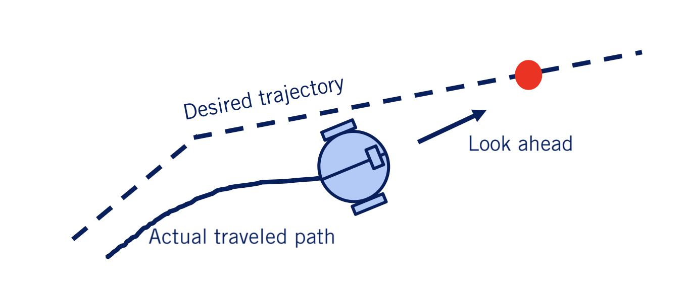
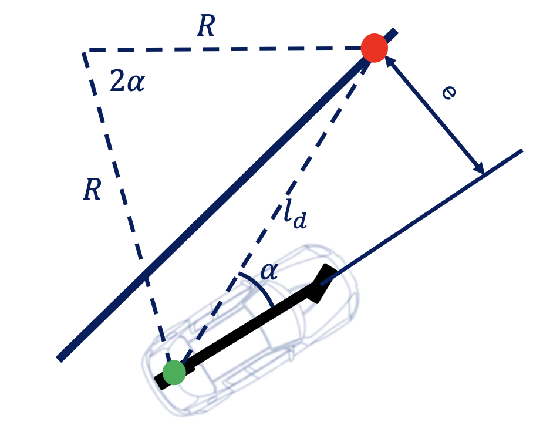
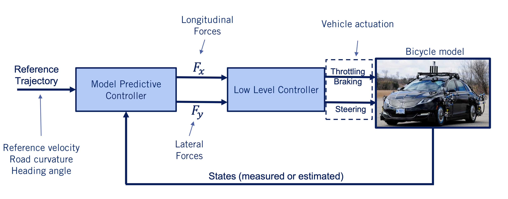

## [__Module 6__: Vehicle Lateral Control]((https://www.coursera.org/specializations/self-driving-cars))

### **Introduction to Lateral Control**

Lateral control is a crucial component of autonomous vehicle systems, ensuring that the vehicle accurately follows a predefined path while maintaining stability and safety.

---

### **Key Concepts in Lateral Control**

1. **Objective of Lateral Control**:
   - Ensure the vehicle tracks a predefined path generated by the planning module.
   - Minimize errors such as:
     - **Heading error**: Difference between the vehicle's heading and the path's heading.
     - **Crosstrack error**: Distance between the vehicle's position and the closest point on the path.

2. **Types of Reference Paths**:
   - **Line Segments**: Simple and compact but may have heading discontinuities.
   - **Waypoints**: A series of closely spaced points that define the path, commonly used due to ease of construction.
   - **Parameterized Curves**: Smooth curves with continuous derivatives, ideal for consistent error calculations.

3. **Categories of Lateral Controllers**:
   - **Geometric Controllers**:
     - Use kinematic models and path geometry.
     - Examples: Pure Pursuit and Stanley controllers.
   - **Dynamic Controllers**:
     - Use dynamic vehicle models and optimization techniques.
     - Example: Model Predictive Controller (MPC).

4. **Error Metrics**:
   - **Heading Error** ($$ \psi $$): Difference between the vehicle's heading and the desired path's heading.
   - **Crosstrack Error** ($$ e_y $$): Perpendicular distance from the vehicle to the desired path.

---

### **Pure Pursuit Controller for Lateral Control**

The **Pure Pursuit Controller**, a geometric path-tracking controller used in autonomous vehicles. Here's a breakdown of the key concepts and steps involved in designing and implementing this controller.

#### **1. Geometric Path Tracking Controllers**
- **Definition:** Controllers that rely on the geometry of the vehicle's kinematics and the reference path to compute steering commands.
- **Assumptions:**
  - No-slip condition (tires do not skid).
  - Kinematic bicycle model is used for simplicity.
- **Limitations:** Performance degrades during aggressive maneuvers or when tire forces are saturated.

#### **2. Pure Pursuit Controller**

  

- **Core Idea:** 
  - The controller uses a **look-ahead point** on the reference path, located a fixed distance ahead of the vehicle.
  - The steering angle is computed to guide the vehicle toward this point by following a circular arc.

#### Key Components:
1. **Look-Ahead Distance ($l_d$):**
   - The fixed distance from the vehicle's rear axle to the look-ahead point on the path.
   - Affects how aggressively the vehicle corrects its trajectory.

2. **Angle ($\alpha$):**
   - The angle between the vehicle's heading direction and the line connecting the rear axle to the look-ahead point.

3. **Curvature ($\kappa$):**
   - The curvature of the path is proportional to the crosstrack error, ensuring that larger errors result in sharper corrections.

#### **3. Derivation of Steering Angle**
The steering angle ($\delta$) is derived using trigonometry and kinematic relationships:

   $$
   \delta = \tan^{-1}\left(\frac{2L\sin(\alpha)}{l_d}\right)
   $$

Where:
- $L$: Wheelbase (distance between front and rear axles).
- $l_d$: Look-ahead distance.
- $\alpha$: Angle between vehicle heading and look-ahead line.

#### **4. Crosstrack Error and Proportional Control**

  

- The crosstrack error ($e$) is defined as:
  $$
  \sin(\alpha) = \frac{e}{l_d}
  $$
- The curvature ($\kappa$) becomes proportional to the crosstrack error:
  $$
  \kappa = \frac{2e}{l_d^2}
  $$
- This behavior mimics a proportional controller, where larger errors result in more aggressive corrections.

#### **5. Speed-Adaptive Look-Ahead Distance**
To address limitations at different speeds:
- The look-ahead distance is made proportional to the forward velocity:
  $$
  l_d = K_{PP} \cdot v_f
  $$
Where:
- $K_{PP}$: Pure pursuit gain.
- $v_f$: Forward velocity.

This ensures smoother corrections at high speeds and more responsive corrections at low speeds.

#### **Advantages of Pure Pursuit Controller**
1. Simple to implement.
2. Works well under no-slip conditions.
3. Adaptive look-ahead distance improves performance across different speeds.

#### **Limitations**
1. Assumes no-slip tire behavior; performance degrades during aggressive maneuvers.
2. Does not account for dynamic forces like lateral acceleration or jerk.
3. Requires careful tuning of parameters like look-ahead gain ($K_{PP}$).

---

### **Stanley Controller for Lateral Control**

The **Stanley Controller**, a geometric path-tracking controller that was instrumental in the success of Stanford's autonomous vehicle, Stanley, in the DARPA Grand Challenge. Below is a detailed breakdown of its design, functionality, and real-world applications.

#### **1. Overview of the Stanley Controller**
- **Purpose:** The Stanley Controller is designed to correct both **heading error** and **crosstrack error** to ensure precise path tracking.
- **Key Features:**
  - Uses the front axle as the reference point for error calculations.
  - Eliminates the need for a look-ahead distance (unlike the Pure Pursuit Controller).
  - Scales proportional control gain inversely with vehicle speed, ensuring stable performance at varying speeds.

#### **2. Components of the Stanley Controller**
##### **Error Metrics:**
1. **Heading Error ($$ \psi $$):**
   - The angular difference between the vehicle's heading and the desired path direction.
   - Corrected by steering commands opposite to the error.

2. **Crosstrack Error ($$ e $$):**
   - The perpendicular distance between the front axle and the closest point on the path.
   - Corrected using proportional control scaled by speed:
     $$
     \text{Control Term} = \frac{k \cdot e}{v_f + k_{\text{soft}}}
     $$
   - Here, $k_{\text{soft}}$ is a positive constant added to stabilize low-speed operation.

##### **Control Law:**
The steering angle ($\delta$) is computed as:
$$
\delta = \psi + \tan^{-1}\left(\frac{k \cdot e}{v_f + k_{\text{soft}}}\right)
$$
Where:
- $k$: Crosstrack error gain.
- $v_f$: Forward velocity.
- $k_{\text{soft}}$: Softening constant for low-speed stability.

#### **3. Convergence Properties**
- The Stanley Controller ensures **global stability**, meaning it can correct arbitrarily large errors in heading or position.
- Crosstrack error decays exponentially over time:
  $$
  e(t) = e_0 \cdot e^{-\frac{k}{v_f}t}
  $$
  - Faster vehicles travel farther before converging but take the same time to align with the path.

#### **4. Enhancements for Real-World Performance**
To address limitations in practical scenarios:
1. **Low-Speed Stability:** Add a softening constant ($k_{\text{soft}}$) to prevent aggressive steering caused by noisy velocity estimates.
2. **High-Speed Damping:** Include a damping term for heading rate to reduce excessive lateral forces during high-speed maneuvers.
3. **Feedforward Term:** Add a feedforward component to account for desired path curvature, improving tracking on curved paths.

#### **5. Applications and Limitations**

##### Applications:
- Used extensively in autonomous vehicles for moderate-speed path tracking.
- Ideal for environments where tire dynamics remain linear (e.g., urban driving).

##### Limitations:
- Does not account for actuator dynamics, tire saturation, or noisy measurements.
- Performance degrades in high-curvature paths or aggressive maneuvers.

---

### **Model Predictive Control (MPC)**

  

**Model Predictive Control (MPC)** is an advanced control strategy used in autonomous vehicles for both longitudinal and lateral control. Below is a detailed breakdown of the concepts, architecture, and applications discussed.

---

#### **1. Overview of Model Predictive Control**
- **Definition:** MPC is a control approach that solves an optimization problem at each time step to compute the optimal control inputs for a finite prediction horizon.
- **Key Features:**
  - Incorporates dynamic modeling into the controller design.
  - Handles constraints on states, inputs, and outputs directly.
  - Optimizes multiple objectives simultaneously (e.g., trajectory tracking, minimizing control effort).

#### **2. Receding Horizon Control**
- MPC is often referred to as **Receding Horizon Control** because:
  - At each time step, the controller solves an optimization problem over a fixed horizon.
  - The horizon "recedes" as time progresses, focusing on the next set of future states.

##### **Steps in Receding Horizon Control:**
1. Define the prediction horizon length ($T$).
2. Use the vehicle's predicted state at the end of the optimization as the initial state for the next time step.
3. Solve the optimization problem to compute control inputs over the horizon.
4. Apply only the first control input from the solution and repeat at the next time step.

#### **3. MPC Architecture**
- **Block Diagram Components:**
  - **Optimizer Block:** Solves the optimization problem using constraints, cost functions, and predicted errors.
  - **Dynamic Model:** Predicts future states based on past inputs and current actuator signals.
  - **Outputs:** Lateral and longitudinal forces are converted into throttle, braking, and steering commands.

#### **4. Optimization Formulation**
##### **Linear MPC:**
- Uses a linear state-space model:
  $$
  x_{k+1} = A \cdot x_k + B \cdot u_k
  $$
- Objective function minimizes quadratic costs:
  $$
  J = \sum_{k=0}^{T} \left[ (x_k - x_{\text{ref}})^T Q (x_k - x_{\text{ref}}) + u_k^T R u_k \right]
  $$
  Where:
  - $Q$: Weight matrix for state error.
  - $R$: Weight matrix for control effort.

##### **Nonlinear MPC:**
- Uses nonlinear models (e.g., kinematic bicycle model).
- Constraints can include:
  - Maximum steering angles.
  - Tire force limits.
  - Inequality or equality constraints specific to vehicle dynamics.
- Solved numerically since no closed-form solution exists.

#### **5. Application in Autonomous Vehicles**
##### **Trajectory Tracking:**
- Inputs:
  - Reference trajectory (path and velocity).
  - Current vehicle states.
- Outputs:
  - Lateral and longitudinal forces converted into throttle, braking, and steering commands.

#### **6. Advantages of MPC**
1. Handles constraints naturally (e.g., actuator limits, tire force bounds).
2. Optimizes multiple objectives simultaneously.
3. Works with both linear and nonlinear models, allowing flexibility in design.

#### **7. Limitations of MPC**
1. High computational requirements due to solving optimization problems at each time step.
2. Requires robust solvers to ensure feasible solutions within tight time windows.
3. Sensitive to disturbances if prediction models are inaccurate.

---

### **Comparison Table: Pure Pursuit, Stanley, and MPC**

| **Aspect**                  | **Pure Pursuit**                                                                                     | **Stanley**                                                                                       | **Model Predictive Control (MPC)**                                                                 |
|-----------------------------|-----------------------------------------------------------------------------------------------------|--------------------------------------------------------------------------------------------------|----------------------------------------------------------------------------------------------------|
| **Reference Point**         | Uses a look-ahead point ahead of the vehicle.                                                       | Uses the front axle as the reference point.                                                     | Considers the entire trajectory over a prediction horizon, using a state-space model for prediction. |
| **Steering Computation**    | Based on an arc to a future look-ahead point, using trigonometry and geometry.                      | Based on minimizing heading error and crosstrack error directly.                                | Solves an optimization problem at each time step to minimize a cost function over the prediction horizon. |
| **Key Formula**             | Arctangent of curvature to reach look-ahead point.                                                  | Arctangent of proportional control term for crosstrack error, combined with heading correction. | No explicit formula; uses numerical optimization to compute control inputs (e.g., steering and throttle). |
| **Trajectory Tracking**     | Creates smooth trajectories by guiding the vehicle toward a moving look-ahead point.                | Aligns position (crosstrack error) and direction (heading error) with the path, often resulting in sharper corrections. | Tracks the trajectory by optimizing control inputs while considering constraints like actuator limits and tire forces. |
| **Constraints Handling**    | Does not explicitly handle constraints.                                                            | Does not explicitly handle constraints.                                                        | Explicitly handles input/output constraints, such as maximum steering angle or tire force limits[1][2]. |
| **Adaptability**            | Limited adaptability; performance depends on tuning of look-ahead distance and speed scaling.       | Sensitive to noisy measurements and requires tuning for low-speed stability and high-speed damping. | Highly adaptable; can incorporate dynamic models, changing objectives, and constraints in real-time[1][3]. |
| **Computational Complexity**| Low; simple geometric calculations make it computationally efficient.                              | Low; relies on simple proportional control logic for errors.                                    | High; requires solving an optimization problem at every time step, which can be computationally expensive[1][3]. |

---

### **Summary of Differences**
- **Pure Pursuit:** Computes steering based on an arctan of a future point ahead of the vehicle, creating smooth trajectories but with limited adaptability.
- **Stanley:** Computes steering by combining heading and crosstrack errors into a control law, resulting in sharper corrections but better accuracy in aligning with the path.
- **MPC:** Uses optimization over a prediction horizon to compute control inputs that minimize errors while respecting constraints, making it highly flexible but computationally intensive.

MPC stands out as the most advanced method due to its ability to handle constraints and optimize performance across multiple objectives, but it comes at the cost of higher computational demands compared to Pure Pursuit and Stanley controllers.

###### REFERENCES:
1. Module 6：Vehicle Lateral Control - GitHub https://github.com/qiaoxu123/Self-Driving-Cars/blob/master/Part1-Introduction_to_Self-Driving_Cars/Module6-Vehicle_Lateral_Control/module-6-vehicle-lateral-control.md
1. Reference Path Estimation for Lateral Vehicle Control - Safer https://www.saferresearch.com/library/reference-path-estimation-lateral-vehicle-control
1. [PDF] Lateral Control of an Autonomous Vehicle https://repository.lboro.ac.uk/articles/Lateral_control_of_an_autonomous_vehicle/9225788/files/16805318.pdf
1. [PDF] Trajectory Generation for an On-Road Autonomous Vehicle https://tsapps.nist.gov/publication/get_pdf.cfm?pub_id=823570
1. Lateral Control Tutorial - MathWorks https://www.mathworks.com/help/driving/ug/lateral-control-tutorial.html
1. [PDF] Path Planning and Integrated Collision Avoidance for Autonomous ... https://merl.com/publications/docs/TR2017-072.pdf
1. Lateral control | Autonomous Vehicle Systems Class Notes - Fiveable https://library.fiveable.me/autonomous-vehicle-systems/unit-6/lateral-control/study-guide/V8p7zGc9d30CCPF1
1. Path planning algorithms in the autonomous driving system https://www.sciencedirect.com/science/article/pii/S0921889024000137
1. New control model for autonomous vehicles using integration of ... https://www.nature.com/articles/s41598-024-69858-7
1. Lateral Controller Stanley - MathWorks https://www.mathworks.com/help/driving/ref/lateralcontrollerstanley.html
1. Vehicle Path Tracking Using Stanley Controller - GitHub https://github.com/mathworks/vehicle-stanley-controller
1. [PDF] Autonomous Automobile Trajectory Tracking for Off-Road Driving https://ai.stanford.edu/~gabeh/papers/hoffmann_stanley_control07.pdf
1. Vehicle Path Tracking Using Stanley Controller - YouTube https://www.youtube.com/watch?v=FHQFya0-JBs
1. How can I implement a Stanley Controller for a Differential Drive? https://www.reddit.com/r/robotics/comments/12xuv03/how_can_i_implement_a_stanley_controller_for_a/
1. Stanley (vehicle) - Wikipedia https://en.wikipedia.org/wiki/Stanley_(vehicle)
1. YouTube Video Compating Pure Pursuit vs MPC https://www.youtube.com/watch?v=4IO1zxsY4wU
1. Automated-driving-using-model-predictive-control.html https://www.mathworks.com/help/mpc/ug/automated-driving-using-model-predictive-control.html
1. [PDF] Code Generation for Receding Horizon Control - Stanford University https://web.stanford.edu/~boyd/papers/pdf/code_gen_rhc_msc.pdf
1. New control model for autonomous vehicles using integration of ... https://www.nature.com/articles/s41598-024-69858-7
1. [PDF] Receding Horizon Estimation and Model Predictive Control for Basic ... https://mplab.ee.columbia.edu/sites/default/files/content/Publications/Zhou2022ITEC1%20-%20Integrated%20Design%20of%20Receding%20Horizon%20Estimation%20and%20Model%20Predictive%20Controlfor%20LC%20Based%20Power%20Module%20with%20High%20Performance%20and%20Low%20Cost.pdf
1. Autonomous driving with Model Predictive Control - Junsheng Fu https://junshengfu.github.io/Model-Predictive-Control/
1. Model Predictive Control (MPC) - The Receding Horizon. - YouTube https://www.youtube.com/watch?v=9OYWiuefK14
1. Model Predictive Control for Autonomous Driving Vehicles - MDPI https://www.mdpi.com/2079-9292/10/21/2593
1. Receding Horizon Control - an overview | ScienceDirect Topics https://www.sciencedirect.com/topics/engineering/receding-horizon-control
1. automated-driving-using-model-predictive-control.html https://www.mathworks.com/help/mpc/ug/automated-driving-using-model-predictive-control.html
1. New control model for autonomous vehicles using integration of ... https://www.nature.com/articles/s41598-024-69858-7
1. Autonomous driving with Model Predictive Control - Junsheng Fu https://junshengfu.github.io/Model-Predictive-Control/
1. [PDF] Robust Model Predictive Control for Autonomous Driving - DiVA portal https://www.diva-portal.org/smash/get/diva2:1131360/FULLTEXT01.pdf
1. Model Predictive Control for Autonomous Driving Vehicles - MDPI https://www.mdpi.com/2079-9292/10/21/2593
1. MPC used in autonomous driving companies? : r/ControlTheory https://www.reddit.com/r/ControlTheory/comments/dg885l/mpc_used_in_autonomous_driving_companies/
1. Autonomous Driving using Linear Model Predictive Control with a ... https://www.sciencedirect.com/science/article/abs/pii/S2405896322023254
1. Graded Quiz Help https://github.com/Vinohith/Self_Driving_Car_specialization/blob/master/Introduction_to_Self-Driving_Cars/Week_6/MODULE_6_GRADED_QUIZ.md